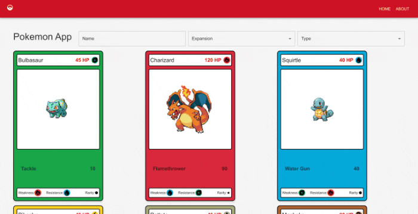

# CookUnity - Engineer Coding Challenge

This document aims to outline the decisions and assumptions made on both the frontend ('client') & backend ('server') repositories during the development of the "Pokemon App", the Engineer Coding Challenge requested as part of CookUnity's selection process. Additionally, it provides a guideline to run the app.



## Task Details

### Frontend

- ViteJS was used to set up the React/Typescript app.
- Material UI was used to build the UI components.
- Axios was used to handle the requests to the backend.

### Backend

- The repo was built using the NestJS framework.
- TypeORM was implemented to interact with the database.
- Package @nestjs/swagger was used to generate the swagger, which can be accessed at [BACKEND_URL]/api .

### Database

- PostgreSQL was used as the database for this project.

## Setup

- Clone the repository.
- Navigate to the server directory and run the following commands:
  ```
  cd server
  npm install
  npm run
  ```
- In a separate terminal window, navigate to the client directory and run the following commands:
  ```
  cd client
  npm install
  npm run dev
  ```
- File db/db_sample_data.sql can be executed in the database to generate demo data

## Resources

- [NestJS:](https://nestjs.com/)
- [TypeORM](https://docs.nestjs.com/recipes/sql-typeorm)
- [OpenAPI (Swagger)](https://docs.nestjs.com/openapi/introduction)
- [Vite](https://vitejs.dev/)
- [Material UI](https://mui.com/)
- [Axios](https://axios-http.com/)
