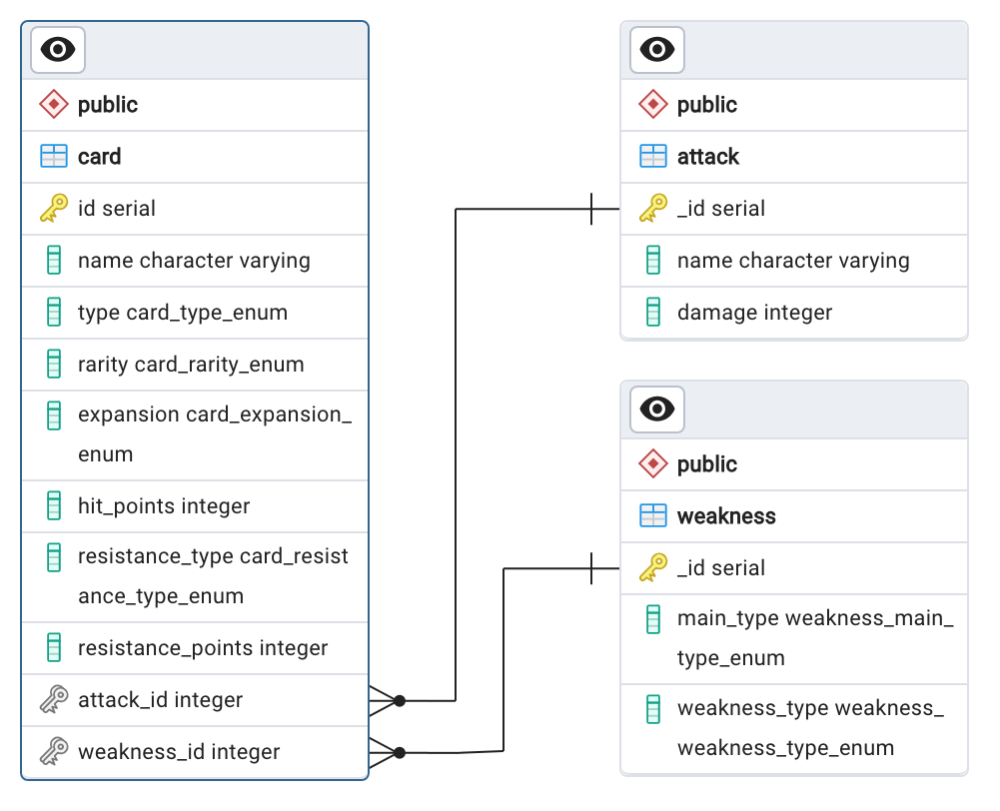

# CookUnity - Engineer Coding Challenge


## Task Details

### Frontend

- ViteJS was used to set up the React/Typescript app.
- Material UI was used to build the UI components.
- Axios was used to handle the requests to the backend.
- React-query was used to manage the state of the requests to the backend.
- Service Poke API was used to retrieve the cards images.

### Backend

- The repo was built using the NestJS framework.
- TypeORM was implemented to interact with the database.
- Package @nestjs/swagger was used to generate the swagger, which can be accessed at [BACKEND_URL]/api .

### Database

- PostgreSQL was used as the database for this project.
- Entity Relationship Diagram:



## Setup

- Clone the repository.
- Navigate to the server directory and fill in an env file with your database credentials and the client URL (an example is provided) 
- Run the following commands:
  ```
  cd server
  npm install
  npm run
  ```
- In a separate terminal window, navigate to the client directory and run the following commands:
  ```
  cd client
  npm install
  npm run dev
  ```
- File db/db_sample_data.sql can be executed in the database to generate demo data

## Resources

- [NestJS:](https://nestjs.com/)
- [TypeORM](https://docs.nestjs.com/recipes/sql-typeorm)
- [OpenAPI (Swagger)](https://docs.nestjs.com/openapi/introduction)
- [Vite](https://vitejs.dev/)
- [Material UI](https://mui.com/)
- [Axios](https://axios-http.com/)
- [React-query](https://tanstack.com/query/v3)
- [PokeAPI](https://pokeapi.co/)
